# A20 NotIST Project Readme

## Team

| Number   | Name              | User                             | E-mail                                            |
| ---------|-------------------|----------------------------------| --------------------------------------------------|
| 1112474  | Jade Le Roux      | <https://github.com/JadeLRX>     | <mailto:jade.le.roux@tecnico.ulisboa.pt>          |
| 102482   | Artur Ferreira    | <https://github.com/artur15888>  | <mailto:artur.crespo.ferreira@tecnico.ulisboa.pt> |
| 103074   | André Roque       | <https://github.com/Andre-Tita>  | <mailto:andre.t.roque@tecnico.ulisboa.pt>         |

  

## Contents

This repository contains documentation and source code for the *Network and Computer Security (SIRS)* project.

The [REPORT](REPORT.md) document provides a detailed overview of the key technical decisions and various components of the implemented project.
It offers insights into the rationale behind these choices, the project's architecture, and the impact of these decisions on the overall functionality and performance of the system.

This document presents installation and demonstration instructions.

## Installation

To see the project in action, it is necessary to setup a virtual environment, with 4 networks (1 external and 3 internal) and 5 machines.

The following diagram shows the networks and machines:

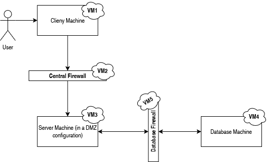

### Prerequisites

All the virtual machines are based on: Linux 64-bit, Kali 2023.3  

[Download](https://www.kali.org/) and [install](https://phoenixnap.com/kb/how-to-install-kali-linux-on-virtualbox) a virtual machine of Kali Linux 2023.3.  

Clone the base machine to create the other machines.

### Machine configurations

For each machine, there is an initialization script with the machine name, with prefix `init-` and suffix `.sh`, that installs all the necessary packages and makes all required configurations in the a clean machine.

Inside each machine, use Git to obtain a copy of all the scripts and code.

```sh
$ git clone https://github.com/tecnico-sec/A20-NotIST.git
```

Next we have custom instructions for each machine.

#### Machine 1: VM1 (Client Machine)

**Ip: 192.168.0.100**

This machine initiates requests to the note-taking service hosted on the server (VM3) using gRPC. It has one network adapter (NAT network) which simulates a external network.

To verify:

First we check the ip route, with the command

```sh
$ ip route
```
It has to be something like this: 

```sh
192.168.0.0/24 dev eth0 proto kernel scope link src 192.168.0.100 
192.168.1.0/24 via 192.168.0.10 dev eth0
``` 
This second line ensures that traffic from the client is destined for the 192.168.1.0/24 via 192.168.0.10 (VM2 firewall), and can then reach the server's ip (192.168.1.1).

To run the client:

First go to the contract folder and type:

```sh
$ mvn clean install # to build
```

Then proceed to the util folder and type:

```sh
$ mvn clean install # to build
```


Finally, go to the client folder and type:

```sh
$ mvn clean install # to build
$ mvn exec:java # to run
```

If everything is working it should appear "Welcome to NotIST !", and you can then use the app as the client.

If you are not welcomed into the NotIST, it could be because of the firewall which the configuration instructions are next. Also rebember that the server has to be running.

#### Machine 2: VM2 (Central Firewall)

**IPs: 192.168.0.10 , 192.168.1.254**

This machine mediates all traffic between the client (VM1) and the server (VM3). It is configured to allow only gRPC traffic (TCP port 50052) between VM1 and VM3. it has 2 network adapters, one NAT and one internal. The NAT network (192.168.0.10) will connect to the client via 192.168.0.0/24 and the internal network (192.168.1.254) will connect to the server via 192.168.1.0/24. 

To verify the firewall rules:

```sh
$ sudo iptables -L -v -n
```

the expected results are:

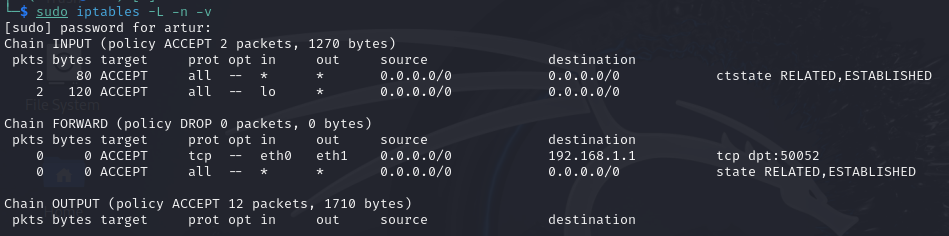

Also important to check the ip route again: 

```sh
$ ip route
```
It has to be something like this: 

```sh
192.168.0.0/24 dev eth0 proto kernel scope link src 192.168.0.10 
192.168.1.0/24 dev eth1 proto kernel scope link src 192.168.1.254 
``` 
These lines ensure that the firewall can reach both the client and the server .

#### Machine 3: VM3 (Server Machine)

**IPs: 192.168.1.1 , 192.168.2.3**

This machine acts as the central hub for the application, processing client requests and interacting with the database. It employs gRPC with TLS to encrypt communication and authenticate clients. it has 2 internal network adapters, and one NAT (just to connect to the internet). One internal network (192.168.1.1) will connect to the firewall (VM2), and the other to the database firewall (VM5). 

To make this work, again we need to check the ip route and add the respective lines, or similar:

```sh
default via 192.168.1.254 dev eth0 onlink
192.168.1.0/24 dev eth0 proto kernel scope link src 192.168.1.1 
192.168.2.0/24 dev eth1 proto kernel scope link src 192.168.2.3 
192.168.3.0/24 via 192.168.2.5 dev eth1 
``` 

These lines ensure the server can basically reach any of the virtual machines in the project. The client machine via VM2 firewall (192.168.1.254) and the Database machine (192.168.3.4) via VM5 Firewall (192.168.2.5)

To run the server, it's similar to the client.

First go to the contract folder and type:

```sh
$ mvn clean install # to build
```

Then proceed to the util folder and type:

```sh
$ mvn clean install # to build
```

Finally, go to the server folder and type:

```sh
$ mvn clean install # to build
$ mvn exec:java # to run
```

If everything is working it should appear "Server started with TLS on port 50052", and you can then run the client code and everything you do there (e.g., login/logout), should appear on the server's terminal.

If the server did not start, it could be because the ip route is wrongly configured, or because of the database firewall, which the configuration instructions are next.

#### Machine 4: VM4 (Database Machine)

**IP: 192.168.3.4**

This machine securely stores all application data, including notes, in an encrypted format. It's  database server that uses PostgreSQL 17.0. It accepts connections only from the server (VM3), via port:5432. It has one network adapter, an internal network one, which will connect to the firewall (VM5).

Checking the ip route, we're expecting something similar to this:

```sh
default via 192.168.3.5 dev eth0 onlink 
```

this line ensures all traffic, will be sent to 192.168.3.5 (VM5 firewall) for forwarding.

To have a proper database you first need to change to the *database* directory and change the **postgres** user *password* to **postgres**:

```sh
sudo -i -u postgres
psql
ALTER USER postgres WITH PASSWORD 'postgres';
```

then create the database **notist** and populate it:

```sh
CREATE DATABASE notist;
```

(Optional): you can give permission to **postgres** user (usually it will already have those permissions):
```sh
GRANT ALL PRIVILEGES ON DATABASE notist TO postgres;
```

proceed to leave and logout from postgres:
```sh
\q
logout
```

finally, enter with the **postgres** user and populate the **notist** database with the necessary tables (found in *schema.sql* on the database folder):
```sh
psql -U postgres # <-- it will ask for the password (type 'postgres')
\c notist
\i schema.sql
\q
```

If everything is working it should try to *drop the tables* (**DROP TABLE**) and it should appear **CREATE TABLE**, about 5 times each.

If anything goes wrong, you should probably check postgres is successfully installed and with the right version.

#### Machine 5: VM5 (Database Firewall)

**IPs: 192.168.2.5 , 192.168.3.5**

This firewall ensures secure access to the database by allowing only authenticated traffic on TCP port 5432. It has 2 internal network adapters, one internal network (192.168.2.5) will connect to the server(VM3), and the other (192.168.3.5) to the database (VM4).

Similar to the first firewall, to verify the firewall rules:

```sh
$ sudo iptables -L -v -n
```

It should look something like this:

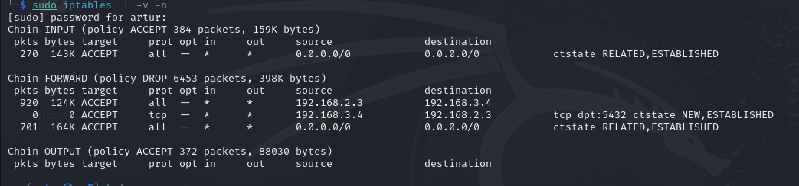

Now, and one last time, we need to check the ip route and add the respective lines, or similar:

```sh
192.168.2.0/24 dev eth0 proto kernel scope link src 192.168.2.5 
192.168.3.0/24 dev eth1 proto kernel scope link src 192.168.3.5
```
These lines ensure we can redirect traffic from the server to the database, and vice-versa.

## Demonstration

Now that all the networks and machines are up and running...

### Application Demonstration

To demonstrate our application and it's best features, we interacted with it and produced the following example:

*Client:*
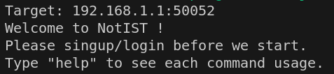

*Server:*


At first, in the client we can type *help* at any time to see which commands are available at the moment, then we can *signup*, since the database is empty we need to *create* a user (For this demonstration we will just use simple *usernames*, *passwords*, *titles* and *notes content*):

***Client**:*
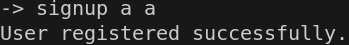

***Server**:*


If we type *help* after logging in/signing up we can see the new available commands. Only after signing up or logging in, we can create a note with the *nnote* command (since the other commands depend on having already a note created and inserted in the database) which opens the Visual Studio Code on a temporary file with the fields to fill to create a note, as we can see:

***Client**:*
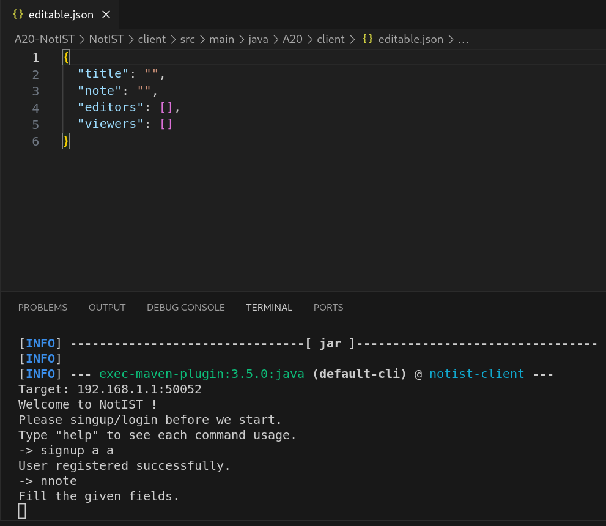

After typing and saving the file, the note is sent to the server and the temporary file it's deleted:

***Client**:*
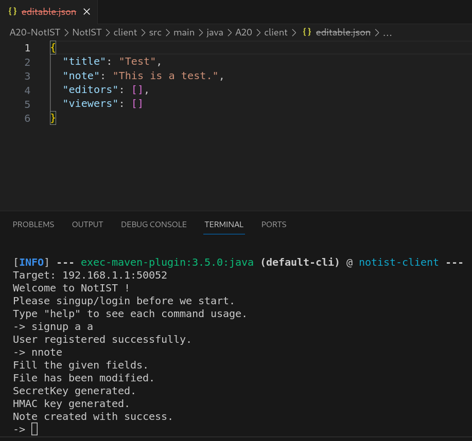

***Server**:*


Then we can see which notes we can access with the command *snotes*:

***Client**:*
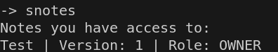

***Server**:*


Now to demonstrate the fully functional project, we create 2 more users, and, as the owner of the note, user *a*, we edit the note and give authorization to the other users (*editor* and *viewer*):

***Client**:*
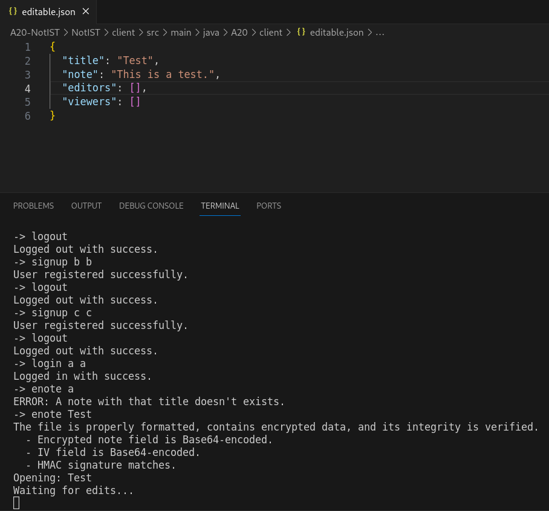

***Server**:*
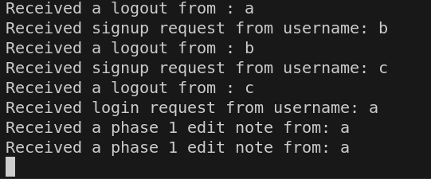
(the first "Received a phase 1 edit note from: a" message corresponds to the "enote a" command, *mistake during the demo*)

Just like in the creation of a note we edit the note as we want, in this case we will just grant the other users the permissions and save it:

***Client**:*
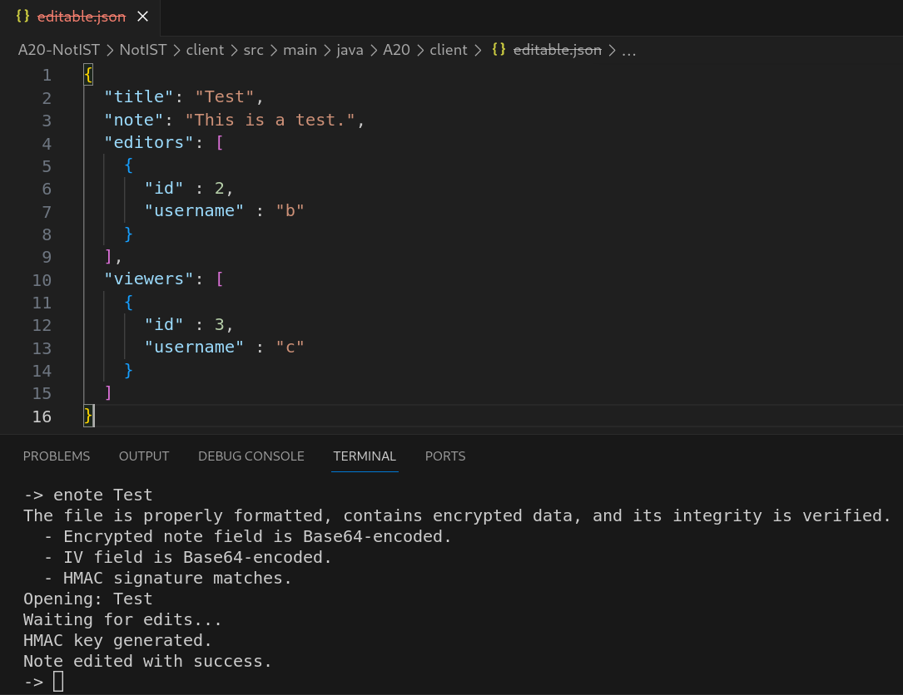

***Server**:*


Now we see the changes on the other users, on user *c* we read the note and on the user *b* we edit it:

**User c:**
***Client**:*
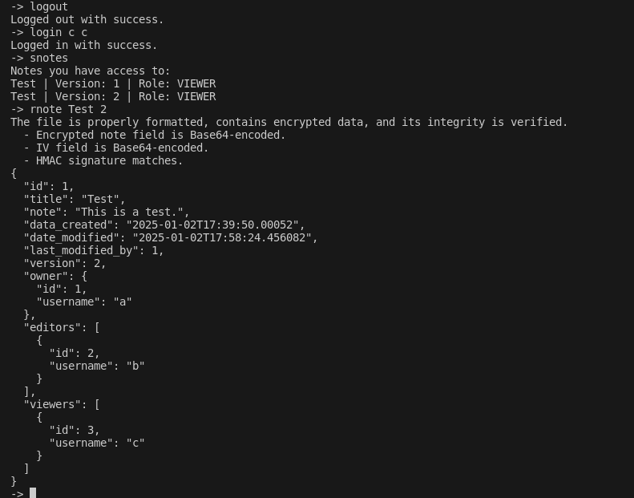

***Server**:*
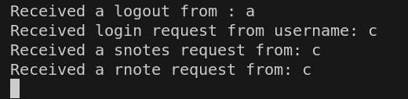

**User b:**
***Client**:*
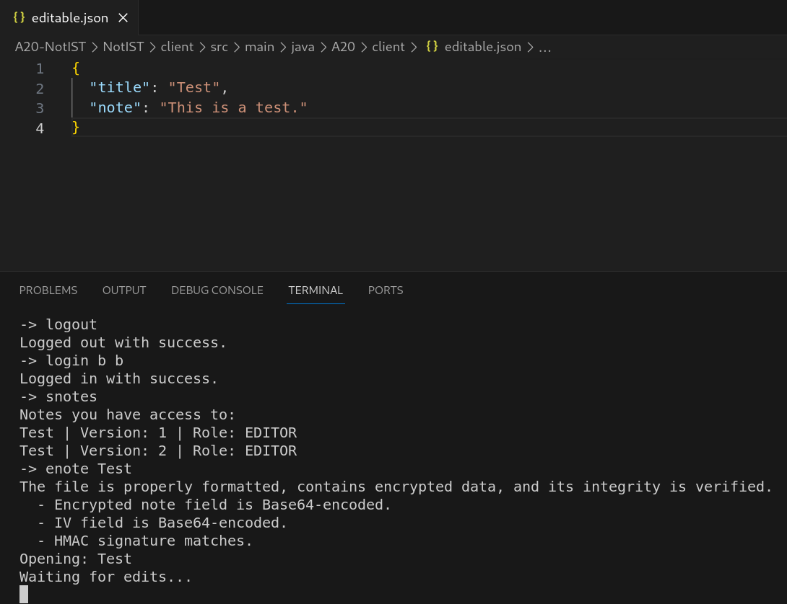

***Server**:*
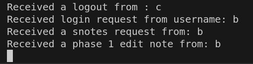

After editing and saving:

***Client**:*
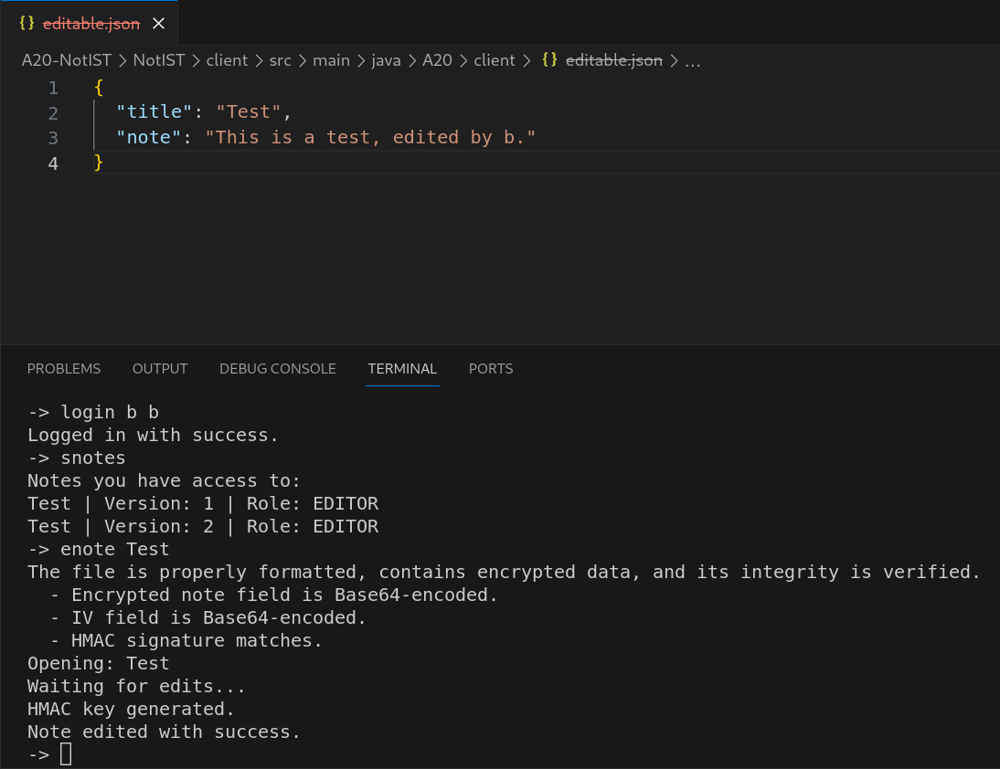

***Server**:*


And finally, switch again to the user *a* and verify the change by the user *b*:

***Client**:*
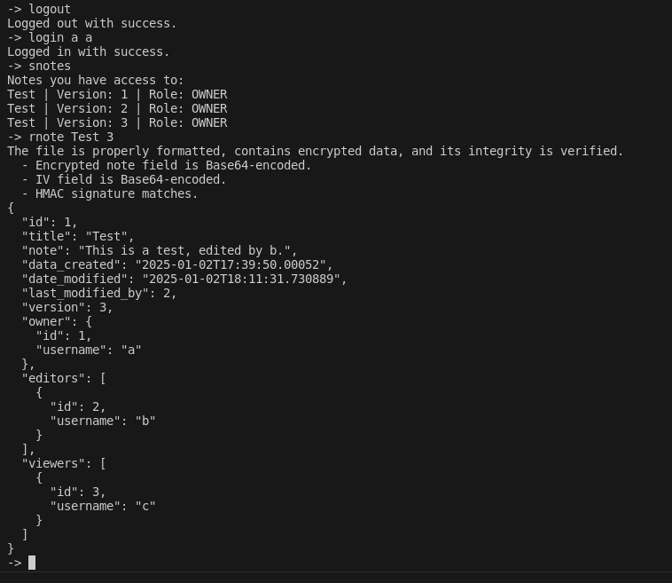

***Server**:*
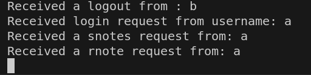

To prove everything is stored encrypted we can see the database tables directly on the database:

***Database**:*
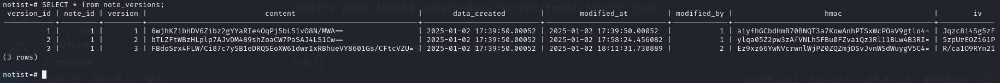

## Firewall Demonstration

### Firewall Test

To test the first firewall (the one between the client and the server), we conducted a simple test to observe what happens when attempting to access a different port (other than port 50052). For example, we used the following command, which lists available services and methods:

```bash
grpcurl -plaintext 192.168.1.1:50053 describe
```

### Result from Listening via tcpdump:

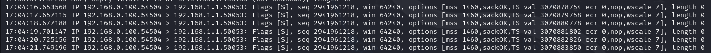

We observed SYN packets, which are connection initiation attempts from the client to the server on port 50053. However, there was no response from the server. Specifically:

- The server did not respond with a SYN-ACK, indicating that either:
  - The firewall is blocking traffic on this port (confirmed).
  - The server is not listening on port 50053 (also confirmed).

---

## TLS in Action

Next, we used the same command but with the correct port:

```bash
grpcurl -plaintext 192.168.1.1:50052 describe
```

### Result from Listening via tcpdump:

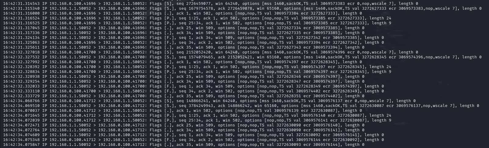

#### TCP Handshake:

The three-way handshake (SYN, SYN-ACK, and ACK) was completed successfully:

1. **SYN:** The client initiates the connection.
2. **SYN-ACK:** The server responds, acknowledging the SYN.
3. **ACK:** The client acknowledges the server's response.

This indicates:

- The server is reachable.
- Port 50052 is open and accepting connections.
- The firewall is not blocking traffic on this port.

#### Initial Data Exchange:

- The client sends data (e.g., PUSH flag in sequences like `seq 1:25`).
- The server acknowledges this data (ACK responses such as `ack 25`).

#### Connection Termination:

1. The server sends a **FIN** packet, signaling it wants to close the connection.
2. The client acknowledges the FIN and sends its own FIN packet, completing the connection closure.

**Conclusion:** While the firewall allows the connection to reach the server, the server closes the connection due to the absence of a client-provided server certificate.

---

## Verifying TLS Functionality

Finally, we tested the connection with the correct port and the server certificate:

```bash
grpcurl -cacert server.crt 192.168.1.1:50052 list
```

### Result from Listening via tcpdump:

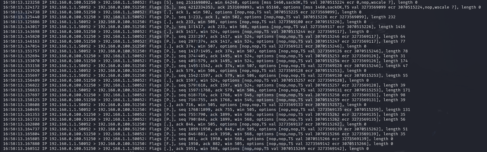

#### Observations:

- The connection was successfully established.
- Data flowed back and forth without interruptions.
- The session ended gracefully.

This confirms that:

- The TLS handshake was successful.
- Application-layer exchanges were completed securely.

---
## Trying DOS attacks

We wanted to test the server's resilience under high load or malicious traffic. With this we ran the following command to send a flood of TCP SYN packets on a TEST virtual machine and used the tcpdump on the firewall to listen to what was happening:

```bash
hping3 -S -p 50052 192.168.1.1 --flood
```
While this was happening, we ran the client machine and the client code and tried to use the app normally which worked well. It is worth noting that the attack was made in just one machine, and we did not test a distributed attack.

---

### Conclusion

This demonstration validates that:

1. The app is fully functional.
2. The firewall correctly blocks unauthorized ports (e.g., 50053) and seems to handle flood attacks.
3. TLS ensures secure communication when the client provides the correct server certificate and connects via the appropriate port.


## Additional Information
On the Client Machine, ensure your Visual Studio Code is with the *Auto-Save* turned off. It may cause some errors if you don't.

Our project doesn't support changing the title of a note during the edition.

### Links to Used Tools and Libraries

- [Java 23.0.1](https://openjdk.java.net/) (java on the VM's)
- [Maven 3.8.8](https://maven.apache.org/)
- [Visual Studio Code](https://code.visualstudio.com/)
- [TcpDump](https://www.tcpdump.org/)
- [IPTables](https://linux.die.net/man/8/iptables)
- [Hping](https://www.kali.org/tools/hping3/)

### Versioning

---

### License

This project doesn't have a license.

----
END OF README
